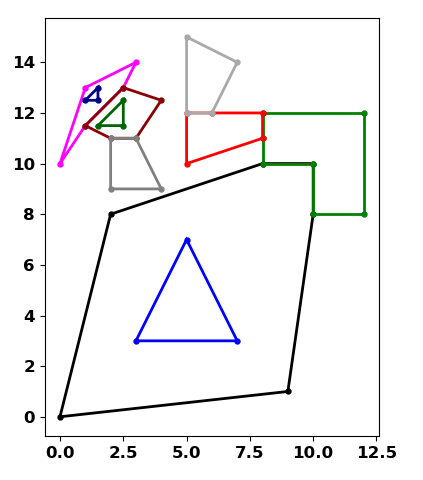

# Geo array basics

<a href="url"></a>

Import **npg** and take a subsample of some featureclass (in_fc) geometry objects (g).

IFT refers to the feature `id` value, the `from` and `to` points.

To reduce numeric problems, the value of the lower left corner is subtracted from all coordinates moving coordinate space into quadrant I.  You could also subtract the mean value of the points which would center the shapes about the x-y axis origin.

```python
test2(sq2, kind=2)  # a polygon featureclass with 6 shapes
```

---------
**Listing of Geo array properties and functions**

npg.dirr(sq2)

```python
npg.dirr(sq2)

----------------------------------------------------------------------
| npg.dirr(npg.npGeo) ...
|    <class 'npg.Geo'>
-------... Geo class ...

  (001)  Bit                    CL                     FT                     
  (002)  Fr                     H                      IDs                    
  (003)  IFT                    IFT_str                IP                     
  (004)  Info                   K                      LL                     
  (005)  N                      PID                    SR                     
  (006)  SVG                    To                     U                      
  (007)  UR                     X                      XT                     
  (008)  XY                     Y                      Z                      
  (009)  __author__             __dict__               __firstlineno__        
  (010)  __module__             __name__               __static_attributes__  
  (011)  all_parts              all_shapes             aoi_extent             
  (012)  aoi_rectangle          areas                  as_arrays              
  (013)  as_lists               bit_IFT                bit_ids                
  (014)  bit_pnt_cnt            bit_seq                bits                   
  (015)  boundary               bounding_circles       centers                
  (016)  centroids              change_indices         close_polylines        
  (017)  common_segments        convex_hulls           densify_by_distance    
  (018)  densify_by_factor      densify_by_percent     dupl_pnts              
  (019)  extent_centers         extent_corner          extent_pnts            
  (020)  extent_rectangles      extents                facts                  
  (021)  fill_holes             first_bit              first_part             
  (022)  fr_to_pnts             fr_to_segments         geo_props              
  (023)  geom_check             get_shapes             holes_to_shape         
  (024)  inner_IFT              inner_rings            is_clockwise           
  (025)  is_convex              is_in                  is_multipart           
  (026)  is_multipart_report    lengths                maxs                   
  (027)  means                  min_area_rect          mins                   
  (028)  moveto                 multipart_to_singlepart od_pairs               
  (029)  outer_IFT              outer_rings            part_IFT               
  (030)  part_ids               parts                  perimeters             
  (031)  pnt_counts             pnt_ids                pnt_indices            
  (032)  pnt_on_poly            polygon_angles         polygons_to_polylines  
  (033)  polyline_angles        polylines_to_polygons  polys_to_points        
  (034)  prn                    prn_arr                prn_obj                
  (035)  radial_sort            roll_shapes            rotate                 
  (036)  segment_angles         segment_pnt_ids        segment_polys          
  (037)  shapes                 shift                  shp_IFT                
  (038)  shp_ids                shp_part_cnt           shp_pnt_cnt            
  (039)  shp_pnt_ids            simplify_lines         singleton_pnts         
  (040)  slice_                 sort_by_area           sort_by_extent         
  (041)  sort_by_length         sort_coords            split_by               
  (042)  structure              svg                    to_fr_segments         
  (043)  to_segments            translate              triangulate            
  (044)  uniq_pnts              unique_segments        xy_id                  

Functions from modules ...
npg_geom_ops ...
  (045)  _ch_                   _ch_scipy_             _ch_simple_            
  (046)  bin_pnts               common_extent          densify_by_distance    
  (047)  densify_by_factor      dist_array             eucl_dist              
  (048)  extent_to_poly         find_closest           in_hole_check          
  (049)  mabr                   near_analysis          on_line_chk            
  (050)  pnts_in_pnts           pnts_on_poly           pnts_to_extent         
  (051)  polys_to_segments      polys_to_unique_pnts   segments_to_polys      
  (052)  simplify               simplify_lines         spider_diagram         
  (053)  triangulate_pnts       which_quad             
npg_geom_ops  helpers ...
  (054)  _add_pnts_on_line_     _closest_pnt_on_poly_  _dist_along_           
  (055)  _e_2d_                 _is_pnt_on_line_       _percent_along_        
  (056)  _pnt_on_segment_       
npg_geom_hlp ...
  (057)  a_eq_b                 classify_pnts          close_pnts             
  (058)  coerce2array           common_pnts            compare_geom           
  (059)  compare_segments       del_seq_dups           dist_angle_sort        
  (060)  flat                   geom_angles            interweave             
  (061)  keep_geom              multi_check            pnt_segment_info       
  (062)  radial_sort            reclass_ids            remove_geom            
  (063)  segment_angles         shape_finder           sort_segment_pairs     
  (064)  sort_xy                swap_segment_pnts      
npg_geom_hlp helpers ...
  (065)  _adj_within_           _angles_3pnt_          _angles_from_north_    
  (066)  _angles_from_xaxis_    _area_centroid_        _bit_area_             
  (067)  _bit_check_            _bit_crossproduct_     _bit_length_           
  (068)  _bit_min_max_          _bit_segment_angles__angle_between_ _clean_segments_       
  (069)  _from_to_pnts_         _get_base_             _in_LBRT_              
  (070)  _in_extent_            _is_ccw_               _is_clockwise_         
  (071)  _is_convex_            _is_turn               _od_angles_dist_       
  (072)  _perp__iterate_        _pnts_in_extent_       _rotate_               
  (073)  _scale_                _trans_rot_            _translate_            
npg_io ...
  (074)  dtype_info             load_geo               load_geo_attr          
  (075)  save_geo               load_txt               save_txt               
  (076)  load_geojson           geo_to_geojson         geojson_to_geo         
  (077)  get_keys               prn_keys               _len_check_            
  (078)  lists_to_arrays        nested_len             
npg_prn ...
  (079)  _svg                   prn_                   prn_Geo_shapes         
  (080)  prn_arrays             prn_as_obj             prn_geo                
  (081)  prn_lists              prn_q                  prn_tbl                

```

----

**Geo array creation**

__new__(cls, g=None, IFT=None, Kind=2, Info="Geo array")

**g : array_like**
  - A 2D array sequence of points with shape (N, 2).

**IFT : array_like**
  - Defines, the I(d)F(rom)T(o) and other structural elements that are
    present in polyline or polygon geometry that `arr` represents.
    Shape (N, 6) required.

**Kind : integer**
  - Points (0), polylines/lines (1) and polygons (2).

**Info : text (optional)**
  - Optional information if needed.

----

**Properties**

```python
g      the ndarray of xy coordinates
g.T  # ---- g.T shown
# ---- Geo[[Xs], [Ys]]

Geo([[ 10.0,  10.0,  1.5,  0.0,  10.0,  3.0,  3.0,  9.0,  9.0,  3.0,  2.0,
       1.0,  2.0,  2.0,  2.0,  1.0,  1.0,  2.0,  8.0,  8.0,  4.0,  5.0,  8.0,
       6.0,  5.0,  7.0,  6.0,  25.0,  25.0,  15.0,  15.0,  23.0,  23.0,  15.0,
       15.0,  25.0,  20.0,  20.0,  12.0,  12.0,  20.0,  20.0,  10.0,  10.0,
       14.0,  20.0,  11.0,  12.0,  12.0,  11.0,  10.5,  10.5,  11.5,  10.5,
       10.5,  10.5,  11.5,  10.5,  14.0,  10.0,  15.0,  14.0],
     [ 10.0,  0.0,  1.5,  10.0,  10.0,  9.0,  3.0,  3.0,  9.0,  9.0,  7.0,
       7.0,  5.0,  7.0,  8.0,  9.0,  8.0,  8.0,  8.0,  4.0,  4.0,  7.0,  8.0,
       7.0,  5.0,  5.0,  7.0,  14.0,  4.0,  4.0,  6.0,  6.0,  12.0,  12.0,
       14.0,  14.0,  10.0,  8.0,  8.0,  2.0,  2.0,  0.0,  0.0,  10.0,  10.0,
       10.0,  9.0,  8.5,  9.0,  9.0,  8.5,  7.0,  7.0,  8.5,  2.0,  0.5,  0.5,
       2.0,  10.0,  10.0,  18.0,  10.0]])
```
The structure and relationships between the array elements is given in the ``IFT`` property.

g.IFT  ==> Id, From, To - shape ID, from-to points in the shape

```python
g.IFT
array([[ 1,  0,  5,  1,  1,  0],
       [ 1,  5, 10,  0,  1,  1],
       [ 1, 10, 14,  0,  1,  2],
       [ 1, 14, 18,  0,  1,  3],
       [ 1, 18, 23,  1,  2,  0],
       [ 1, 23, 27,  0,  2,  1],
       [ 2, 27, 36,  1,  1,  0],
       [ 2, 36, 46,  1,  2,  0],
       [ 2, 46, 50,  0,  2,  1],
       [ 2, 50, 54,  0,  2,  2],
       [ 2, 54, 58,  0,  2,  3],
       [ 3, 58, 62,  1,  1,  0]], dtype=int32)
```
Geo array ==> 
  - shape identification (IDs)
  - from (FR)
  - to (To)
  - clockwise (CW)
  - part ids (PID)
  - bit ids (Bit)
  - from-to (FT)
  - shape type (K)
  - information string (Info)

```python
g.IDs  IFT[:, 0]   shape identifier
[1 1 1 ... 2 2 3]

g.Fr   IFT[:, 1]   shape from point
[ 0  5 10 ... 50 54 58]

g.To   IFT[:, 2]         to point
[ 5 10 14 ... 54 58 62]

g.CW   IFT[:, 3]   shape orientation (C)lock(W)ise boolean result
[1 0 0 ... 0 0 1]

g.PID  IFT[:, 4]   part identifier within a shape
[1 1 1 ... 2 2 1]

g.Bit  IFT[:, 5]   bit identifier with a shape
[0 1 2 ... 2 3 0]

g.FT   IFT[:, 1:3] from-to point pairs
[[ 0  5]
 [ 5 10]
 [10 14]
 ...
 [50 54]
 [54 58]
 [58 62]]

g.K ... 2 ...  shape kind 1, 2, 3 for points, polylines, polygons
g.Info ... test ... extra information string

g.H ... Help on Geo arrays

**Geo class**
-------------

Construction from an ndarray, IFT, Kind and optional Info.

Parameters
----------
**Required**

arr : array-like
    A 2D array sequence of points with shape (N, 2).
IFT : array-like
    Defines, the I(d)F(rom)T(o) and other structural elements that are
    present in polyline or polygon geometry that `arr` represents .
    Shape (N, 6) required.
Kind : integer
    Points (0), polylines/lines (1) and polygons (2).
Info : string (optional)
    Optional information if needed.

**Derived**

IDs : IFT[:, 0]
    Shape ids, the id number will be repeated for each part and hole in
    the shape
Fr : IFT[:, 1]
    The ``from`` point in the point sequence.
To : IFT[:, 2]
    The ``to`` point in the point sequence.
CW : IFT[:, 3]
    A value of ``1`` for exterior rings, ``0`` for interior/holes.
PID : IFT[:, 4]
    Part ids sequence by shape.  A singlepart shape will have one (1) part.
    Subsequent parts are numbered incrementally.
Bit : IFT[:, 5]
    The bit sequence in a singlepart feature with holes and/or multipart
    features with or without holes
FT : IFT[:, 1:3]
    The from-to ids together (Fr, To).
IP : IFT[:, [0, 4]]
    Shape and part ids together (IDs, PID)
N : integer
    The number of unique shapes.
U : integer(s)
    A sequence of integers indicating the feature ID value.  There is no
    requirement for these to be sequential.
SR : text
    Spatial reference name.
X, Y, XY, Z: Derived from columns in the point array.
    X = arr[:, 0], Y = arr[:, 0], XY = arr[:, :2],
    Z = arr[:, 2] if defined
XT : array
    An array/list of points identifying the lower-left and upper-right,
    of full extent of all the geometry objects.
LL, UR : array
    The extent points as defined in XT.
hlp : this
    self.H or self.docs where self is a Geo array will recall this information.

A featureclass with 3 shapes. The first two are multipart with holes.

arr.IFT  # ---- annotated ----
#      IDs, Fr, To, CW, PID, Bit
array([[ 1,  0,  5,  1,   1,  0],  # first shape, first part, outer ring
       [ 1,  5, 10,  0,   1,  1],  # hole 1
       [ 1, 10, 14,  0,   1,  2],  # hole 2
       [ 1, 14, 18,  0,   1,  3],  # hole 3
       [ 1, 18, 23,  1,   2,  0],  # first shape, second part, outer ring
       [ 1, 23, 27,  0,   2,  1],  # hole 1
       [ 2, 27, 36,  1,   1,  0],  # second shape, first part, outer ring
       [ 2, 36, 46,  1,   2,  0],  # second shape, second part, outer ring
       [ 2, 46, 50,  0,   2,  1],  # hole 1
       [ 2, 50, 54,  0,   2,  2],  # hole 2
       [ 2, 54, 58,  0,   2,  3],  # hole 3
       [ 3, 58, 62,  1,   1,  0]], # third shape, first part, outer ring
                     dtype=int64)
```
----

**Derived Properties**

----

shape, part, and bit        : N, part_cnt, bit_cnt

shape, part and bit ids     : shp_ids, part_ids, bit_ids

shape, part and bit counts  : shp_IFT, part_IFT, bit_IFT

x, y and XY coordinates     : X, Y, XY)

```python
- sample size, unique shapes
g.N ... 3 ...  len(uni)   #  uni, idx = np.unique(arr.IDs, True)
g.U ... [1 2 3] ...  g.IDs[idx]

- coordinate values
g.X    g[:, 0]
[ 10.00  10.00  1.50 ...  10.00  15.00  14.00]

g.Y    g[:, 1]
[ 10.00  0.00  1.50 ...  10.00  18.00  10.00]

g.XY   g[:, :2]
[[ 10.00  10.00]
 [ 10.00  0.00]
 [ 1.50  1.50]
 ...
 [ 10.00  10.00]
 [ 15.00  18.00]
 [ 14.00  10.00]]

g.g[    not implemented yet
- identifiers by shape, part, bit

g.shp_IFT
[[ 1  0 27 -1 -1 -1]
 [ 2 27 58 -1 -1 -1]
 [ 3 58 62 -1 -1 -1]]

g.part_IFT
[[ 1  0 18  1  1  0]
 [ 1 18 27  1  2  0]
 [ 2 27 36  1  1  0]
 [ 2 36 58  1  2  0]
 [ 3 58 62  1  1  0]]

g.bit_IFT
[[ 1  0  5  1  1  0]
 [ 1  5 10  0  1  1]
 [ 1 10 14  0  1  2]
 ...
 [ 2 50 54  0  2  2]
 [ 2 54 58  0  2  3]
 [ 3 58 62  1  1  0]]

g.shp_ids  :[1 2 3]
g.part_ids :[1 1 2 2 3]
g.bit_ids  :[1 1 1 ... 2 2 3]
g.bit_seq  :[0 1 2 ... 2 3 0]
g.pnt_ids  :[1 1 1 ... 3 3 3]
g.shp_pnt_cnt
[[ 1 27]
 [ 2 31]
 [ 3  4]]

g.shp_part_cnt
[[1 2]
 [2 2]
 [3 1]]

g.bit_pnt_cnt
[[1 0 5]
 [1 1 5]
 [1 2 4]
 ...
 [2 2 4]
 [2 3 4]
 [3 0 4]]

g.shapes
[[ 10.00  10.00]
 [ 10.00  0.00]
 [ 1.50  1.50]
 ...
 [ 5.00  5.00]
 [ 7.00  5.00]
 [ 6.00  7.00]] ... snip
[[ 14.00  10.00]
 [ 10.00  10.00]
 [ 15.00  18.00]
 [ 14.00  10.00]]

g.parts
[ 10.00  10.00] ... snip
[[ 14.00  10.00]
 [ 10.00  10.00]
 [ 15.00  18.00]
 [ 14.00  10.00]]

g.bits
[[ 10.00  10.00]
 [ 10.00  0.00]
 [ 1.50  1.50]
 [ 0.00  10.00]
 [ 10.00  10.00]] ... snip
[[ 14.00  10.00]
 [ 10.00  10.00]
 [ 15.00  18.00]
 [ 14.00  10.00]]
```
----

**Methods.....**

----

```python
(1) g.first_bit(True) ...
[[ 10.00  10.00]
 [ 10.00  0.00]
 [ 1.50  1.50]
 ...
 [ 10.00  10.00]
 [ 15.00  18.00]
 [ 14.00  10.00]]

(2) g.first_bit(True).IFT ...
[[ 1  0  5  1  1  0]
 [ 1  5 10  1  2  0]
 [ 2 10 19  1  1  0]
 [ 2 19 29  1  2  0]
 [ 3 29 33  1  1  0]]

(3) g.first_part(True) ...
[[ 10.00  10.00]
 [ 10.00  0.00]
 [ 1.50  1.50]
 ...
 [ 10.00  10.00]
 [ 15.00  18.00]
 [ 14.00  10.00]]

(4) g.first_part(True).IFT ...
[[ 1  0  5  1  1  0]
 [ 1  5 10  0  1  1]
 [ 1 10 14  0  1  2]
 [ 1 14 18  0  1  3]
 [ 2 18 27  1  1  0]
 [ 3 27 31  1  1  0]]

(5) g.get_shape(ID=3, asGeo=True) ...
[[ 14.00  10.00]
 [ 10.00  10.00]
 [ 15.00  18.00]
 [ 14.00  10.00]]

(6) g.get_shape(ID=3, asGeo=True).IFT ...
[[3 0 4 1 1 0]]

(7) g.outer_rings(asGeo=True) ...
[[ 10.00  10.00]
 [ 10.00  0.00]
 [ 1.50  1.50]
 ...
 [ 10.00  10.00]
 [ 15.00  18.00]
 [ 14.00  10.00]]

(8) g.outer_rings(asGeo=True).IFT ...
[[ 1  0  5  1  1  0]
 [ 1  5 10  1  2  0]
 [ 2 10 19  1  1  0]
 [ 2 19 29  1  2  0]
 [ 3 29 33  1  1  0]]

(9) g.areas(True) ...
[ 57.50  102.25  16.00]

(10) g.areas(False) ...
[85.0, -36.0, -1.0, -0.5, 12.0, -2.0, 52.0, 52.0, -0.25, -0.75, -0.75, 16.0]

(11) g.lengths(True) ...
[ 90.71  123.22  21.50]

(12) g.lengths(False) ...
[37.26267650163207, 24.0, 5.23606797749979,... snip ..., 21.49623888035515]

(13) g.cent_shapes() ...
[[ 4.71  6.60]
 [ 15.35  7.18]
 [ 13.00  12.67]]

(14) g.cent_parts() ...
[[ 5.38  5.38]
 [ 6.25  5.75]
 [ 19.50  9.00]
 [ 15.33  5.56]
 [ 13.00  12.67]]

(15) g.centroids() ...
[[ 7.65  3.56]
 [ 16.51  6.09]
 [ 13.00  12.67]]

(16) g.aoi_extent() ...
[ 0.00  0.00  25.00  18.00]

(17) g.aoi_rectangle() ...
[[ 0.00  0.00]
 [ 0.00  18.00]
 [ 25.00  18.00]
 [ 25.00  0.00]
 [ 0.00  0.00]]

(18) g.extents(splitter="part") ...
[[ 0.00  0.00  10.00  10.00]
 [ 4.00  4.00  8.00  8.00]
 [ 15.00  4.00  25.00  14.00]
 [ 10.00  0.00  20.00  10.00]
 [ 10.00  10.00  15.00  18.00]]

(19) g.extents(splitter="shape") ...
[[ 0.00  0.00  10.00  10.00]
 [ 10.00  0.00  25.00  14.00]
 [ 10.00  10.00  15.00  18.00]]

(20) g.extent_centers(splitter="part") ...
[[ 5.00  5.00]
 [ 6.00  6.00]
 [ 20.00  9.00]
 [ 15.00  5.00]
 [ 12.50  14.00]]

(21) g.extent_centers(splitter="shape") ...
[[ 5.00  5.00]
 [ 17.50  7.00]
 [ 12.50  14.00]]

(22) g.extent_rectangles(splitter="shape") ...
[array([[ 300000.00,  5000000.00],
       [ 300000.00,  5000010.00],
       [ 300010.00,  5000010.00],
       [ 300010.00,  5000000.00],
       [ 300000.00,  5000000.00]]), array([[ 300010.00,  5000000.00],
       [ 300010.00,  5000014.00],
       [ 300025.00,  5000014.00],
       [ 300025.00,  5000000.00],
       [ 300010.00,  5000000.00]]), array([[ 300010.00,  5000010.00],
       [ 300010.00,  5000018.00],
       [ 300015.00,  5000018.00],
       [ 300015.00,  5000010.00],
       [ 300010.00,  5000010.00]])]

(23) g.extent_rectangles(splitter="part") ...
[array([[ 300000.00,  5000000.00],
       [ 300000.00,  5000010.00],
       [ 300010.00,  5000010.00],
       [ 300010.00,  5000000.00],
       [ 300000.00,  5000000.00]]), array([[ 300004.00,  5000004.00],
       [ 300004.00,  5000008.00],
       [ 300008.00,  5000008.00],
       [ 300008.00,  5000004.00],
       [ 300004.00,  5000004.00]]), array([[ 300015.00,  5000004.00],
       [ 300015.00,  5000014.00],
       [ 300025.00,  5000014.00],
       [ 300025.00,  5000004.00],
       [ 300015.00,  5000004.00]])]

(24) g.maxs(by_bit=False) ...
[[ 10.00  10.00]
 [ 25.00  14.00]
 [ 15.00  18.00]]

(25) g.maxs(by_bit=True) ...
[[ 10.00  10.00]
 [ 8.00  8.00]
 [ 25.00  14.00]
 [ 20.00  10.00]
 [ 15.00  18.00]]

(26) g.is_clockwise(is_closed_polyline=False) ...
[(1, 1) (1, 0) (1, 0) ... (2, 0) (2, 0) (3, 1)]

(27) g.is_convex() ...
[1 1 0 0 1]

(28) g.is_multipart(as_structured=False) ...
[[1 1]
 [2 1]
 [3 0]]

(29) g.polygon_angles(inside=True, in_deg=True) ...
[array([ 90.00,  79.99,  110.02,  79.99]),
 array([ 71.57,  90.00,  71.57,  126.87]),
 array([ 90.00,  90.00,  90.00,  90.00,  270.00,  270.00,  90.00,  90.00]),
 array([ 90.00,  90.00,  270.00,  270.00,  90.00,  90.00,  90.00,  90.00, 180.00]),
 array([ 97.13,  57.99,  24.88])
 ]

(30) g.bounding_circles(angle=5, return_xyr=False) ...
[[ 0.00  8.26]
 [ 0.03  8.88]
 [ 0.11  9.49]
 ...
 [ 9.93  16.44]
 [ 9.87  16.85]
 [ 9.85  17.26]]

(31) g.min_area_rect(as_structured=False) ...
[[ 139.67 -1.41 -1.41  9.49  11.41]
 [ 23.52  3.20  4.60  8.80  8.80]
 [ 100.00  15.00  4.00  25.00  14.00]
 [ 100.00  10.00  0.00  20.00  10.00]
 [ 54.02  8.55  9.74  16.45  16.58]]

(32) g.triangulate(by_bit=False, as_polygon=True) ...
[[ 3.00  9.00]
 [ 0.00  10.00]
 [ 10.00  10.00]
 ...
 [ 10.00  10.00]
 [ 15.00  18.00]
 [ 14.00  10.00]]

(33) g.fill_holes() ...
[[ 10.00  10.00]
 [ 10.00  0.00]
 [ 1.50  1.50]
 ...
 [ 10.00  10.00]
 [ 15.00  18.00]
 [ 14.00  10.00]]

(34) g.holes_to_shape() ...
[[ 3.00  9.00]
 [ 9.00  9.00]
 [ 9.00  3.00]
 ...
 [ 11.50  0.50]
 [ 10.50  0.50]
 [ 10.50  2.00]]

(35) g.multipart_to_singlepart(info="") ...
[[ 10.00  10.00]
 [ 10.00  0.00]
 [ 1.50  1.50]
 ...
 [ 10.00  10.00]
 [ 15.00  18.00]
 [ 14.00  10.00]]

(36) g.od_pairs() ...
[[ 10.00  10.00  10.00  0.00]
 [ 10.00  0.00  1.50  1.50]
 [ 1.50  1.50  0.00  10.00]
 [ 0.00  10.00  10.00  10.00]]

(37) g.polygons_to_polylines() ...
[[ 10.00  10.00]
 [ 10.00  0.00]
 [ 1.50  1.50]
 ...
 [ 10.00  10.00]
 [ 15.00  18.00]
 [ 14.00  10.00]]

(38) g.boundary() ...
[[ 10.00  10.00]
 [ 10.00  0.00]
 [ 1.50  1.50]
 ...
 [ 10.00  10.00]
 [ 15.00  18.00]
 [ 14.00  10.00]]

(39) g.polys_to_points(keep_order=True, as_structured=False) ...
[[ 10.00  10.00]
 [ 10.00  0.00]
 [ 1.50  1.50]
 ...
 [ 10.50  0.50]
 [ 11.50  0.50]
 [ 15.00  18.00]]

(40) g.densify_by_distance(spacing=1)n ...
[[ 10.00  10.00]
 [ 10.00  9.00]
 [ 10.00  8.00]
 ...
 [ 14.13  11.05]
 [ 14.01  10.06]
 [ 14.00  10.00]]

(41) g.densify_by_percent(percent=50) ...
[[ 10.00  10.00]
 [ 10.00  4.63]
 [ 10.00  0.00]
 ...
 [ 15.00  18.00]
 [ 14.25  12.00]
 [ 14.00  10.00]]

```
----

**Others of interest**

----

A simplified informational table of a Geo array's IFT array with annotations.  Useful for documentation purposes.
```python
sq2.structure()

Geo array structure
-------------------
OID_    : self.Id   shape id
Fr_pnt  : self.Fr   from point id
To_pnt  : self.To   to point id for a shape
CW_CCW  : self.CW   outer (1) inner/hole (0)
Part_ID : self.PID  part id for each shape
Bit_ID  : self.Bit  sequence order of each part in a shape
----

...    OID_    Fr_pnt    To_pnt    CW_CCW    Part_ID    Bit_ID  
--------------------------------------------------------------
 000      1         0         7         1          1         0
 001      1         7        11         0          1         1
 002      2        11        19         1          1         0
 003      3        19        25         1          1         0
 004      4        25        30         1          1         0
 ```

