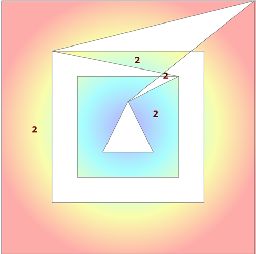

----
# Multipart shapes

<a href="url"></a>

Consider the following multipart shapes.  The first shape has is second part slightly offset and it also contains a hole.  The second shape is a flip/mirror/translate of its first part.

The centroids of each part are shown on the image.  These locations have been confirmed using arcpy and npGeo methods.

The point coordinates with (300,000 m, 5,000,000 m, MTM 9) subtracted from their values.  So the data are in a projected coordinate system and all further measures will be in planar/metric units.


```
 npg.prn_geo(g)  # ---- Geo array representation of a polygon featureclass

 pnt shape  part     X       Y     
--------------------------------
 000     1         10.00   10.00  first point of outer ring
 001     1         10.00    0.00
 002     1          0.00    0.00   # ----  shape 1: a polygon with 3 holes
 003     1          0.00   10.00
 004     1         10.00   10.00  last point of outer ring
 005     1   -o     3.00    9.00  first point of first inner ring
 006     1          3.00    3.00
 007     1          9.00    3.00
 008     1          9.00    9.00
 009     1          3.00    9.00  last  point of first inner ring
 010     1   -o     8.00    8.00  first point of second inner ring
 011     1          8.00    4.00
 012     1          4.00    4.00
 013     1          4.00    8.00
 014     1          8.00    8.00  last point of second inner ring
 015     1   -o     6.00    7.00  first point of third inner ring
 016     1          5.00    5.00
 017     1          7.00    5.00
 018     1  ___     6.00    7.00  last point of third inner ring AND the end of the first shape
 019     2   -o    12.00    8.00
 020     2         12.00    2.00
 021     2         20.00    2.00
 022     2         20.00    0.00
 023     2         10.00    0.00
 024     2         10.00   10.00
 025     2         14.00   10.00
 026     2         20.00   10.00
 027     2         20.00    8.00
 028     2         12.00    8.00
 029     2   -o    25.00   14.00    # ----  shape 2: a two part polygon without holes
 030     2         25.00    4.00
 031     2         15.00    4.00
 032     2         15.00    6.00
 033     2         23.00    6.00
 034     2         23.00   12.00
 035     2         15.00   12.00
 036     2         15.00   14.00
 037     2  ___    25.00   14.00   Now... you figure out the rest ;)
 038     3   -o    14.00   10.00
 039     3         10.00   10.00
 ... snip

``` 
 
This shape (s2) is simply represented by the last 2 columns, the first 2 columns are solely for printing purposes.
The sequence of points is identified by their Id and From and To points (IFT)

```
g.IFT
array([[  1,   0,   5,   1,   1,   0],
       [  1,   5,  10,   0,   1,   1],
       [  1,  10,  15,   1,   2,   0],
       [  1,  15,  19,   0,   2,   1],
       [  2,  19,  29,   1,   1,   0],
       [  2,  29,  38,   1,   2,   0],
       [  3,  38,  42,   1,   1,   0],
   ... snip ...
   ], dtype=int64)

```
I added another method to the pack to expand upon the IFT information. 
```
g.info  # ---- g.info returns extent, shape, part, point and structure information
--------------
Extents :
  LL [ 300000. 5000000.]
  UR [ 300036.71 5000033.  ]
Shapes :    12
Parts  :    16
Points :   145

...    OID_    From_pnt    To_pnt    Ring_type    Part_ID    Bit_seq  
--------------------------------------------------------------------
 000      1           0         5            1          1          0
 001      1           5        10            0          1          1
 002      1          10        15            1          2          0
 003      1          15        19            0          2          1
 004      2          19        29            1          1          0
 005      2          29        38            1          2          0
 006      3          38        42            1          1          0
  ... snip ...
```
There is an alternate approach...
```
npg.prn_tbl(g.IFT_str)

...    OID_    From_pnt    To_pnt    Ring_type    Part_ID    Bit_seq  
--------------------------------------------------------------------
 000      1           0         5            1          1          0
 001      1           5        10            0          1          1
 002      1          10        15            1          2          0
 003      1          15        19            0          2          1
 004      2          19        29            1          1          0
 005      2          29        38            1          2          0
 006      3          38        42            1          1          0
 ... snip ...
```
As is shown **prn_tbl** produces a nicely labelled output from the structured array that can be returned from the **IFT_str** method.
A quick survey shows repetition of the shape ID in the *Part* column.  The *Points* for each part are given, from which the *From_ID* and *To_ID* values are derived.

Either approach allows you to quickly look back at geometry structure.


----
The methods and functions that will be shown use this information in their processing.  In this fashion, it is possible to try and optimize the derivation of properties and application of functions by using the whole point sequence of their subgroupings.

This will obviously not be possible in all situations, but every bit helps.


----
# ndarray values from esri geometry


**(1) The arcpy geometry**

This is what the geometry looks like for the first shape (multipart with holes).

```
p0
<Polygon object at 0x2a193f76128[0x2a18ea2d8a0]>

p0[:2]  # ---- two parts, so slice
[<Array [<Point (300010.0, 5000020.0, #, #)>, <Point (300010.0, 5000010.0, #, #)>, <Point (300000.0, 5000010.0, #, #)>,
         <Point (300000.0, 5000020.0, #, #)>, <Point (300010.0, 5000020.0, #, #)>,
         None,
         <Point (300003.0, 5000019.0, #, #)>, <Point (300003.0, 5000013.0, #, #)>, <Point (300009.0, 5000013.0, #, #)>,
         <Point (300009.0, 5000019.0, #, #)>, <Point (300003.0, 5000019.0, #, #)>]>,
 <Array [<Point (300008.0, 5000018.0, #, #)>, <Point (300008.0, 5000014.0, #, #)>, <Point (300004.0, 5000014.0, #, #)>,
         <Point (300004.0, 5000018.0, #, #)>, <Point (300008.0, 5000018.0, #, #)>,
         None,
         <Point (300006.0, 5000017.0, #, #)>, <Point (300005.0, 5000015.0, #, #)>, <Point (300007.0, 5000015.0, #, #)>,
         <Point (300006.0, 5000017.0, #, #)>]>]
```
The polygon consists of two parts, represented as the arcpy.Array.  This in turn consists of sequences of arcpy.Point values with outer rings ordered clockwise and inner rings/holes, order counter-clockwise.  Inner and outer rings are separated by None, rather than a null point since a null point, unfortunately, has X and Y values of 0.
```
(arcpy.Point()
<Point (0.0, 0.0, #, #)>
```


**(2)  FeatureClassToNumPyArray**

The standby, great for singlepart simple shapes.  You have to read the X, and Y coordinates separately or as a ``SHAPE@XY`` since reading the ``SHAPE@`` to retrieve the object directly is not permitted.

In the examples below, extra effort would have to be made to subtract the extent minimum from each point to obtain their values relative to it.

```
a0 = arcpy.da.FeatureClassToNumPyArray(in_fc3, ['SHAPE@X', 'SHAPE@Y'], explode_to_points=True, spatial_reference=SR)
a0
array([(300010., 5000020.), (300010., 5000010.), (300000., 5000010.), (300000., 5000020.),
       (300010., 5000020.), (300003., 5000019.), (300003., 5000013.), (300009., 5000013.),
       (300009., 5000019.), (300003., 5000019.), (300008., 5000018.), (300008., 5000014.),
       (300004., 5000014.), (300004., 5000018.), (300008., 5000018.), (300006., 5000017.),
       (300005., 5000015.), (300007., 5000015.), (300006., 5000017.), (300012., 5000018.),
       (300012., 5000012.), (300020., 5000012.), (300020., 5000010.), (300010., 5000010.),
       (300010., 5000020.), (300020., 5000020.), (300020., 5000018.), (300012., 5000018.),
       (300025., 5000024.), (300025., 5000014.), (300015., 5000014.), (300015., 5000016.),
       (300023., 5000016.), (300023., 5000022.), (300015., 5000022.), (300015., 5000024.),
       (300025., 5000024.)], dtype=[('SHAPE@X', '<f8'), ('SHAPE@Y', '<f8')])
```


**(3)  SearchCursors and the ``__geo_interface__`` method**

Works, and useful if you intend to work with the arcgis module.  There are variants on this as well depending on whether you want arrays or arrays or just an array of objects.

```
with arcpy.da.SearchCursor(in_fc3, 'SHAPE@', None, SR) as cursor:
    a1 = [row[0].__geo_interface__['coordinates'] for row in cursor] 
```
```
a1  # ---- as a list of values ----
[[[[(300010.0, 5000020.0),
    (300010.0, 5000010.0),
    (300000.0, 5000010.0),
    (300000.0, 5000020.0),
    (300010.0, 5000020.0)],
   [(300003.0, 5000019.0),
    (300003.0, 5000013.0),
    (300009.0, 5000013.0),
    (300009.0, 5000019.0),
    (300003.0, 5000019.0)]]],
 [[[(300008.0, 5000018.0),
    (300008.0, 5000014.0),
    (300004.0, 5000014.0),
    (300004.0, 5000018.0),
    (300008.0, 5000018.0)],
   [(300006.0, 5000017.0),
    (300005.0, 5000015.0),
    (300007.0, 5000015.0),
    (300006.0, 5000017.0)]]],
 [[[(300012.0, 5000018.0),
    (300012.0, 5000012.0),
    (300020.0, 5000012.0),
    (300020.0, 5000010.0),
    (300010.0, 5000010.0),
    (300010.0, 5000020.0),
    (300020.0, 5000020.0),
    (300020.0, 5000018.0),
    (300012.0, 5000018.0)]]],
 [[[(300025.0, 5000024.0),
    (300025.0, 5000014.0),
    (300015.0, 5000014.0),
    (300015.0, 5000016.0),
    (300023.0, 5000016.0),
    (300023.0, 5000022.0),
    (300015.0, 5000022.0),
    (300015.0, 5000024.0),
    (300025.0, 5000024.0)]]]]

np.asarray(a1)  # ---- as an object array containing lists of coordinates

array([[list([[(300010.0, 5000020.0), (300010.0, 5000010.0), (300000.0, 5000010.0), (300000.0, 5000020.0),
               (300010.0, 5000020.0)], [(300003.0, 5000019.0), (300003.0, 5000013.0), (300009.0, 5000013.0),
               (300009.0, 5000019.0), (300003.0, 5000019.0)]])],
       [list([[(300008.0, 5000018.0), (300008.0, 5000014.0), (300004.0, 5000014.0), (300004.0, 5000018.0),
               (300008.0, 5000018.0)], [(300006.0, 5000017.0), (300005.0, 5000015.0), (300007.0, 5000015.0),
               (300006.0, 5000017.0)]])],
       [list([[(300012.0, 5000018.0), (300012.0, 5000012.0), (300020.0, 5000012.0), (300020.0, 5000010.0),
               (300010.0, 5000010.0), (300010.0, 5000020.0), (300020.0, 5000020.0), (300020.0, 5000018.0),
               (300012.0, 5000018.0)]])],
       [list([[(300025.0042000003, 5000024.0), (300024.9957999997, 5000014.0), (300014.9957999997, 5000014.0),
               (300014.9974999996, 5000016.0), (300022.9974999996, 5000016.0), (300023.0025000004, 5000022.0),
               (300015.0025000004, 5000022.0), (300015.0042000003, 5000024.0), (300025.0042000003, 5000024.0)]])]],
      dtype=object)
```

**(4) Searchcursors and _as_narray**

A related ditty, however, you have to specify the fields directly and you essentially get the equivalent of FeatureClassToNumPyArray.

```
cur = arcpy.da.SearchCursor(in_fc2, ['OID@', 'SHAPE@X', 'SHAPE@Y'], spatial_reference=SR, explode_to_points=True)

cur._as_narray()  # ---- The worker
 
array([(1, 300010., 5000020.), (1, 300010., 5000010.), (1, 300000., 5000010.), (1, 300000., 5000020.),
       (1, 300010., 5000020.), (1, 300003., 5000019.), (1, 300003., 5000013.), (1, 300009., 5000013.),
       (1, 300009., 5000019.), (1, 300003., 5000019.), (1, 300008., 5000018.), (1, 300008., 5000014.),
       (1, 300004., 5000014.), (1, 300004., 5000018.), (1, 300008., 5000018.), (1, 300006., 5000017.),
       (1, 300005., 5000015.), (1, 300007., 5000015.), (1, 300006., 5000017.), (2, 300012., 5000018.),
       (2, 300012., 5000012.), (2, 300020., 5000012.), (2, 300020., 5000010.), (2, 300010., 5000010.),
       (2, 300010., 5000020.), (2, 300020., 5000020.), (2, 300020., 5000018.), (2, 300012., 5000018.),
       (2, 300025., 5000024.), (2, 300025., 5000014.), (2, 300015., 5000014.), (2, 300015., 5000016.),
       (2, 300023., 5000016.), (2, 300023., 5000022.), (2, 300015., 5000022.), (2, 300015., 5000024.),
       (2, 300025., 5000024.)], dtype=[('OID@', '<i4'), ('SHAPE@X', '<f8'), ('SHAPE@Y', '<f8')])

# related

cur._dtype   # ==> dtype([('OID@', '<i4'), ('SHAPE@X', '<f8'), ('SHAPE@Y', '<f8')])

cur.fields   # ==> ('OID@', 'SHAPE@X', 'SHAPE@Y')

```


<a href="url"></a>

The parts and the geometry are not identified within the sequences.  Constructing points from the above is no big deal, but polylines and polygons would fail miserably... as shown in this example.

The need to identify parts and holes in polygons prompted this study to see whether arcpy geometries could be represented in a different manner in numpy array format.  Currently, there are operations that cannot be done simply on arcpy geometries that are so simple in numpy.  Want to shift some polygons a couple of meters?  Just shuffle through a search cursor disassemble the point to an arcpy.Array, cycle through each point (checking for None), then doing the math on each point.  Finally, just reassemble the points array and reconstitute the polygon.  In numpy, if the whole dataset can be represented as an Nx2 array... you just add/subtract from the whole array.  Other functions, like convex hulls will require you to operate on 'chunks' of the array, rather than on the whole dataset at once.  At least nothing needs to be devolved to its smallest part first.  More on this in subsequent sections.


