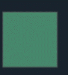
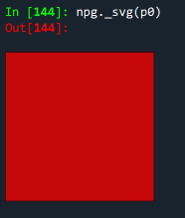
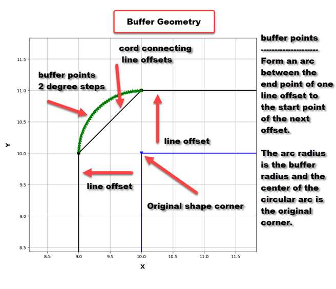
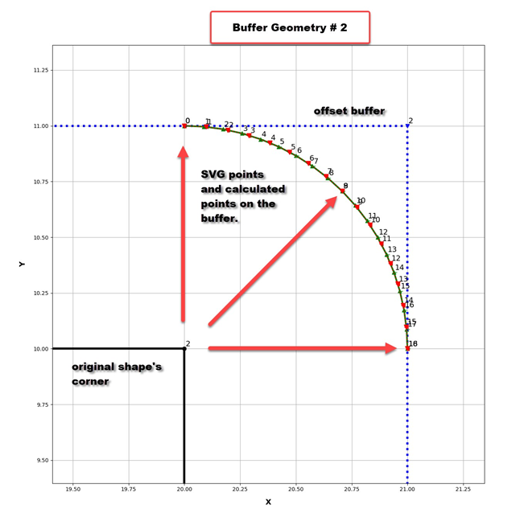

## Buffer ... Geometry Mysteries

----
Author :  Dan Patterson

Current version : 2021-06-20

Original post : 2020-01-27 at https://community.esri.com/t5/python-blog/buffer-geometry-mysteries/ba-p/894169

----

### Buffering ###

Probably one of the first things you did in a GIS class.

*Select all the fast food outlets that are within 1 mile/km of a school.*

To the rescue... a little buffer, a selectorama, intersect, spatial join... whatever.  At some stage you have used buffers for spatial delineation either by creating one as a feature layer, or virtually when you select things within-a-distance-of.
 
So initially I thought I would just show the geometry created by buffering a simple shape or two to show the point densification on the outward corners.  In the old days a buffer around a point was represented by a 36sided circle, if you like, an n-gon.  Pretty good if the buffer was small, but seriously lame when the buffer radius was very large.  Crrrrankout a buffer on a shapefile to see what I mean.  Many a line of code was written to approximate a true circle.  Now you can.
 
But what about a buffer?  The outward corners have that circular appearance, maintaining the offset radius (aka the buffer size) from the line work.  One would expect teeny-tiny circular arcs to appear in the geometry representation.  At worse, perhaps an n-gon representation of the arc.

Not so.

Here is a square green polygon being shown in Spyder with the arcpy's new svg display.


Pretty cool, but I like my numpy array version better (in red)
 
 


----
Here are the coordinates derived from arcpy's polygon array object.

```python
p_0[0]
<Array
  [<Point (300010.0, 5000000.0, #, #)>,
   <Point (300010.0, 5000010.0, #, #)>,
   <Point (300020.0, 5000010.0, #, #)>,
   <Point (300020.0, 5000000.0, #, #)>,
   <Point (300010.0, 5000000.0, #, #)>]>
 ```
 
In both cases, the coordinates are held in an array of some kind as in the above. 
 
In the example p_0 is the arcpy.Polygon and p_0[0] is the slice of the first object within... an arcpy.Array of arcpy.Point objects.
 
So what do the buffer coordinates look like?

### Buffer coordinates ###

Commentary

arcpy.Polygon buffer coordinates

```python
b_0 = p_0.buffer(1)  # buffer by 1 unit
b_0[0] # get the array
<Array
  [<Point (300020.0449000001, 4999999.001, #, #)>,
   <Point (300020.0, 4999999.0, #, #)>,
   <Point (300010.0449000001, 4999999.000499999, #, #)>,
   <Point (300010.0, 4999999.000600001, #, #)>, 
   <Point (300009.0, 5000000.0, #, #)>,
   <Point (300009.0, 5000010.0, #, #)>,
   <Point (300010.0, 5000011.0, #, #)>,
   <Point (300020.0, 5000011.0, #, #)>,
   <Point (300021.0, 5000010.0, #, #)>,
   <Point (300021.0, 5000000.0, #, #)>,
   <Point (300020.0449000001, 4999999.001, #, #)>]>
```
Where are all the points?  I bet you can recognize some, but there is no n-gon representation.
 
Well! No trace of those extra points. Just a few lame ones with a teeny offset from the ones making up the offset lines.
 
What gives?  There is nothing visible in the documentation of by examining the existing methods or properties by conventional methods.

### arcpy's __geo_interface__ ###

Here is the representation from one of arcpy's geometry options.

```python
b_0.__geo_interface__

{'type': 'MultiPolygon',
'coordinates':
[[[(300020.0449000001, 4999999.001),
   (300020.0, 4999999.0),
   (300010.0449000001, 4999999.000499999),
   (300010.0, 4999999.000600001),
   (300009.0, 5000000.0),
   (300009.0, 5000010.0),
   (300010.0, 5000011.0),
   (300020.0, 5000011.0),
   (300021.0, 5000010.0),
   (300021.0, 5000000.0),
   (300020.0449000001, 4999999.001)]]]}
```

### Json ###

JSON to the rescue?  Everyone loves those curly bracket things.

```python
b_0.JSON
'{"curveRings":
  [[[300020.0449000001,4999999.0010000002],
    [300020,4999999],
    [300010.0449000001,4999999.0004999992],
    [300010,4999999.0006000008],
{"c":[ [300009,5000000],
      [300009.29277758137,4999999.2929531736]]},
      [300009,5000010],
{"c":[[300010,5000011],
       [300009.29287232383,5000010.7071276763]]},
      [300020,5000011],
{"c":[[300021,5000010],
       [300020.70712767617,5000010.7071276763]]},
      [300021,5000000],
{"c":[[300020.0449000001,4999999.0010000002],
      [300020.72280301224,4999999.3089512894]]}]],
"spatialReference":{"wkid":2146,"latestWkid":2951}}'

```
 
A bit more information like the curve ring thing.  But still no extra groups of points.

### Scalable vector graphics (svg) ###

What about svg?

```python
b_0svg = b_0.__getSVG__()
b_0svg
'<path fill-rule="evenodd" fill="#66cc99" stroke="#555555" stroke-width="2.0" opacity="0.6" d="
M 300020.0449000001,4999999.001
L 300020,4999999
  L 300010.0449000001,4999999.000499999
... snip
L 300009,5000000
L 300009,5000010
L 300009.0048088113,5000010.098019366
... snip
L 300010,5000011
L 300020,5000011
L 300020.09801936575,5000010.9951911885
...snip
L 300021,5000010
L 300021,5000000
L 300020.9954546047,4999999.904777056
... snip
L 300020.0449000001,4999999.001 z" />'

# ---- now take the same corner as an array
# svg_arr
print(arc)                   ID    degrees
[[20.        , 11.        ],   0
 [20.09801937, 10.99519119],   1
 [20.19509527, 10.98079709],   2    78.75
 [20.29029264, 10.95695635],   3
 [20.38269452, 10.92389861],   4    67.5
 [20.47141085, 10.8819423 ],   5
 [20.55558711, 10.83149154],   6    56.3
 [20.63441247, 10.7730323 ],   7
 [20.70712768, 10.70712768],   8    45.0
 [20.7730323 , 10.63441247],   9
 [20.83149154, 10.55558711],  10
 [20.8819423 , 10.47141085],  11

 ```


SVG to the rescue!

Huge swaths of coordinates for each corner. 

Miraculously, they have appeared by some hidden magic that we are not made party to.
 


So, What do the corners look like?

As expected.

I created the rounded corners for the numpy-based Geo array.

----


In the example below, I plotted the SVG corner points and the Geo array points.


An angle of about 5 degrees (give or take) is used by both.

Smooth enough and you can account for area calculations if you know number of outward buffer corners, the total angular passage and the number n-gon shape.


Or just use arcpy's Polygon methods to get the area.


----

To leave you with some final thoughts. 

You can buffer:

- with a uniform distance around the shape
- an offset buffer, where the shape is expanded parallel to the forming lines (see above)
- a chordal buffer, (Buffer Geometry figure)
- buffer by increasing the area or perimeter (for polygons obviously).
 
This is an example of the last which is based on the offset buffer, but using area as the parameter.


So remember what goes into the buffer and that not all information that you would expect to see is shown in all geometry representations.
