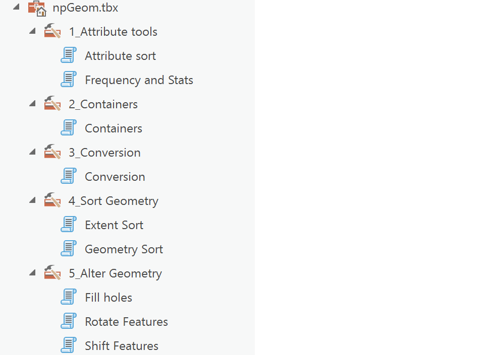
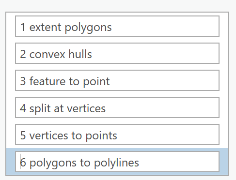

# npGeomTools

----

The following tools are implemented in the npGeom.tbx toolbox for use in ArcGIS Pro.

The *Geo* array, based on a numpy array, is used along with *arcpy* functions to implement the tools.

The tools here are the most recent version of those provided in *FreeTools*

The options for conversion are as follows:

The `extent polygon` is axis aligned extent of the feature geometry.

`Convex hull` is included for convenience.  It uses scipy's Qhull implementation.

`Feature to point` will return the geometry centroid for polygons.

`Split at vertices` is for polygon geometry. From-to point segmentation of the geometry will be returned.

`Vertices to points` applies to polyline/polygon geometry.

`Polygons to polylines` is also a convenience function since it only requires a `Kind (K)` conversion in the Geo class.  The reciprocal function was not implemented because I didn't want to provide a whole load of geometry checks.  If you have polyline geometry that you know will create well-formed polygons, simply change `K`.

*Source image*

../numpy_geometry/images/npGeomTools.png
