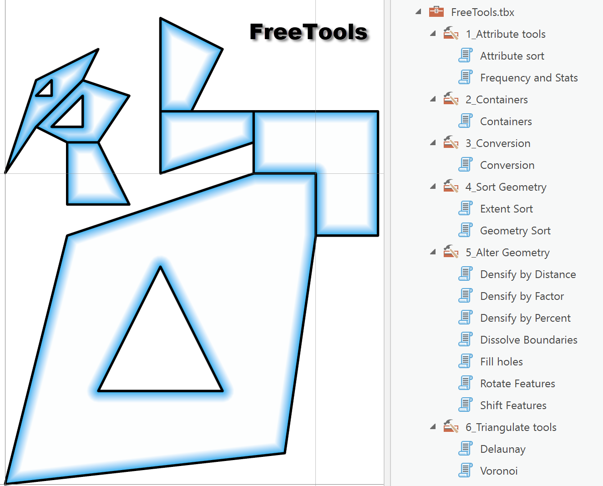
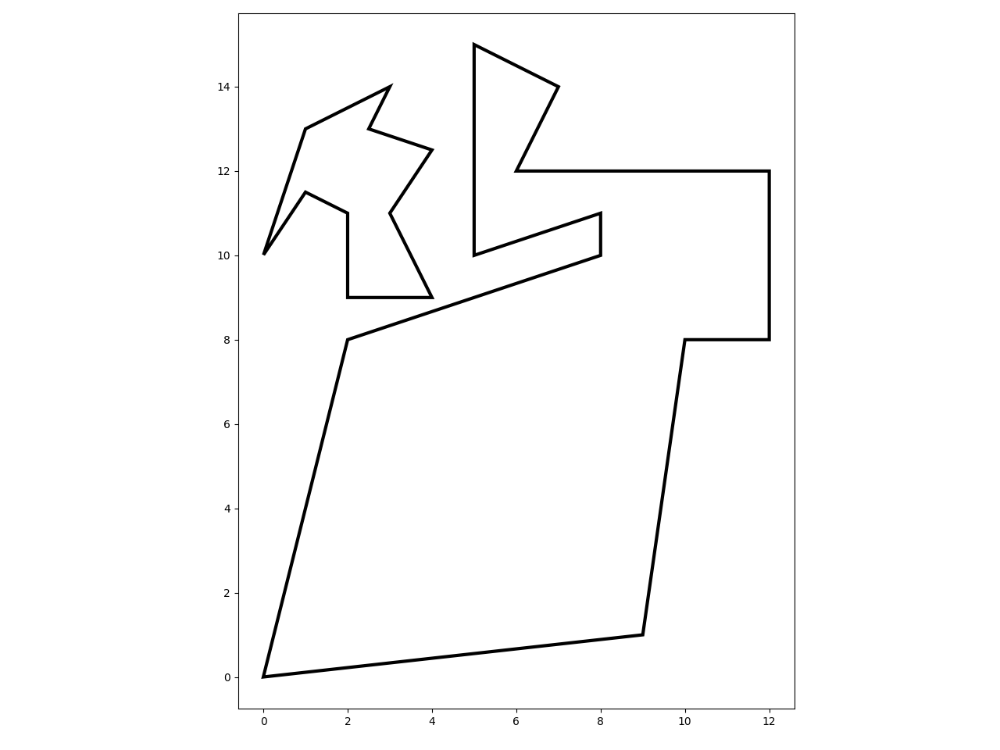
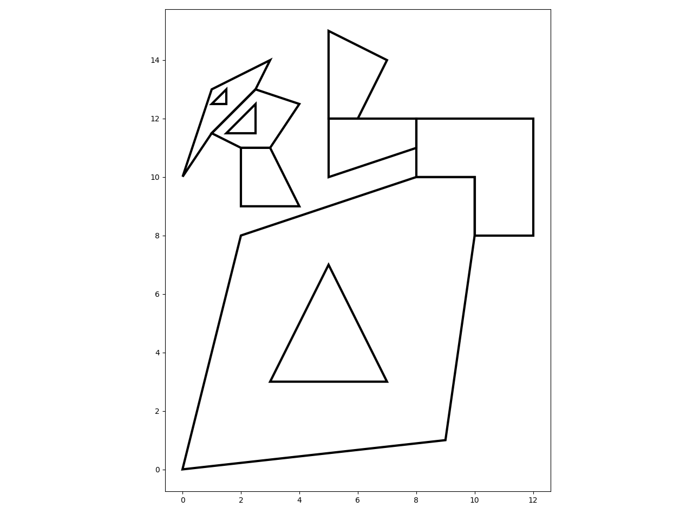
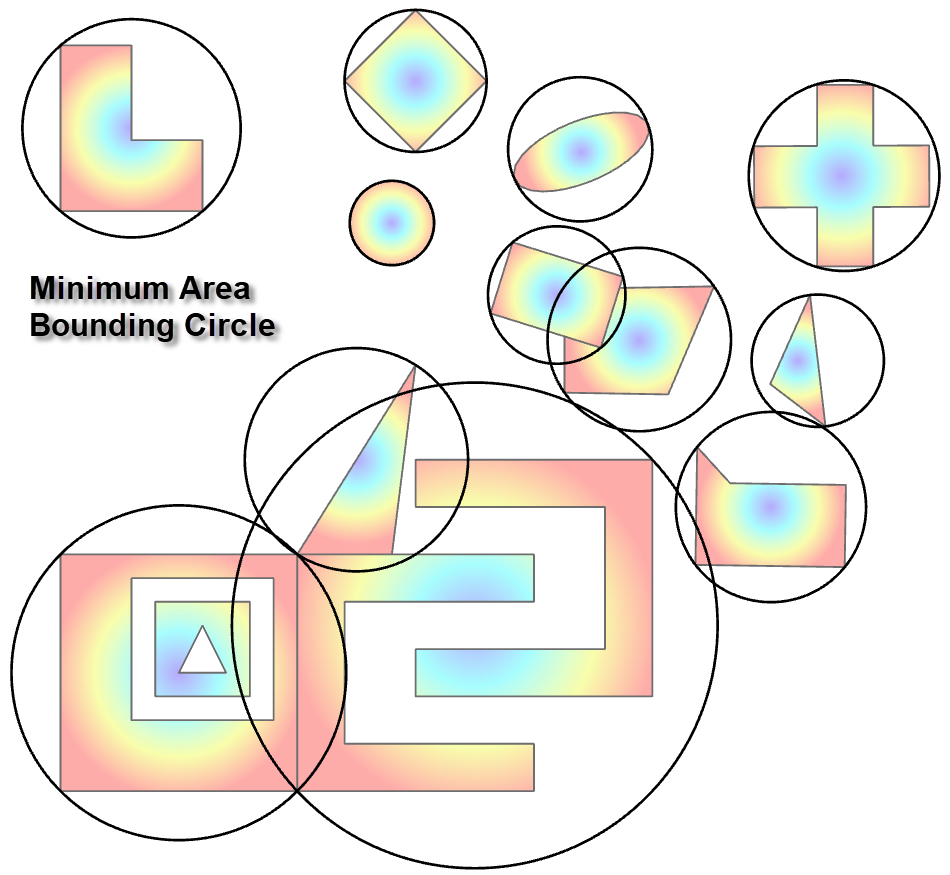

# NumPy Geometry and FreeTools

----

<!--- This is a comment -->
<!--- https://dan-patterson.github.io/numpy_geometry/ -->
<!---  -->
<!---  -->
<!--- The line below is a relative reference.  Make sure that the subdir doesn't begin with a / -->

<!--- arcpro_npg/images/FreeTools.png -->

**New home base for Free Tools**

The image to the right reflects the tools as they stand on 2020/12/20. 
The main script controlling all tools in the toolbox is *tbx_tools.py* in this folder. 

----

Developed in ArcGIS Pro 2.8 - 2.6, python 3.7.10 and 3.6.x-3.6.10 and numpy 1.16.5-1.20.2.

These demo scripts and the toolbox show how numpy and arcpy can play nice together and generate geometries that are normally only available at the ArcGIS Pro Advanced level.  The tools are already provided to do this, but less attention is paid to the attributes.

Usually a spatial and/or attribute join enables one to bring the attributes from the input class to the output class.

This can be done after the geometry is created, or I may have done so during script construction (depending on how bored I was).

In some cases, the outputs are only one option of what the Esri tool provides, for example

    #6 Polygons to Polylines, is just that... 

a simple conversion of the geometry type, no fancy intersection and overlap stuff... 

You get what you pay for, but the widest use is probably the simplest.

----
## Last update : 2021-06-04 ##
Rewrites of many functions to optimize array concatenations.
*npg_clip* is still being tested.  convex polygons pose no problems, but clipping that results in multipart geometries is still being investigated.

## 2020-12-20 update ##
This is not an exhaustive or definitive list of the toolbox functionality... consider it a sampling:

<ins>**Dissolve Boundaries**</ins>

 
Dissolve shared edges in polygon geometry.  The polygons do not need to share a common attribute.
All shared edges are deleted and holes are removed.  Edges that meet at a point are not considered shared since there is no 2D space between the points.

  *Blog post* [Dissolve boundaries](https://community.esri.com/t5/python-blog/dissolve-boundaries/ba-p/1011337)

<ins>**Feature Envelope to Polygon**</ins>

Using the Geo array class, the extent of polyline and polygon features are created from their constituent points.

  *ArcGIS Pro help* [Feature envelope to polygon](https://pro.arcgis.com/en/pro-app/tool-reference/data-management/feature-envelope-to-polygon.htm)

<ins>**Convex hulls**</ins>

Simple convex hull implementation in python, or scipy (feature points > than a threshold)

  *ArcGIS Pro help* [Minimum bounding geometry](https://pro.arcgis.com/en/pro-app/tool-reference/data-management/minimum-bounding-geometry.htm)

<ins>**Feature to Point**</ins>

For polygon features.  Reduces the points to a representative centroid.

  *ArcGIS Pro help* [Feature to point](https://pro.arcgis.com/en/pro-app/tool-reference/data-management/feature-to-point.htm)

<ins>**Split Line at Vertices**</ins>

As it says.  I chose to keep the order of the resultant line segments as they were and not remove apparent `duplicates` for line segments that occur on shared borders.  In such cases, the shared segments will have the same points, but their from-to order is reversed.  There are cases to be made for keeping them or removing them... however, if they are removed, then they are harder to add back in should one want to recreate polygon geometry from the line segments.

  *ArcGIS Pro help* [Split line at vertices](https://pro.arcgis.com/en/pro-app/tool-reference/data-management/split-line-at-vertices.htm)

<ins>**Feature Vertices to Points**</ins>

Convert polygon features to a centroid.  One point is returned for multipart shapes, but this could be altered if someone has a use-case that might be relevant.

  *ArcGIS Pro help* [Feature vertices to points](https://pro.arcgis.com/en/pro-app/tool-reference/data-management/feature-vertices-to-points.htm)

<ins>**Polygons to Polylines**</ins>

Really... You are just changing from polygons to polylines.  They are still a closed geometry, nothing fancy geometry-wise.  Should definitely be **Freed** from its shackles.

  *ArcGIS Pro help* [Feature to polygon](https://pro.arcgis.com/en/pro-app/tool-reference/data-management/feature-to-polygon.htm)

<ins>**Bounding Circles**</ins>

Another container that has been around for a long time in a variety of formats and readily implemented in python.  Sort-of ported this over from an old toolbox for ArcMap, but redone for the new geom class.  Speedy and accurate.

  *ArcGIS Pro help* [Minimum area bounding circles](https://pro.arcgis.com/en/pro-app/tool-reference/data-management/minimum-bounding-geometry.htm)

<ins>**Frequency**</ins>

Another tool that should be free for such basic functionality.

[Create classes from multiple columns](https://community.esri.com/blogs/dan_patterson/2016/03/03/create-classes-from-multiple-columns)
    
  *ArcGIS Pro help* [Frequency](https://pro.arcgis.com/en/pro-app/tool-reference/analysis/frequency.htm)

